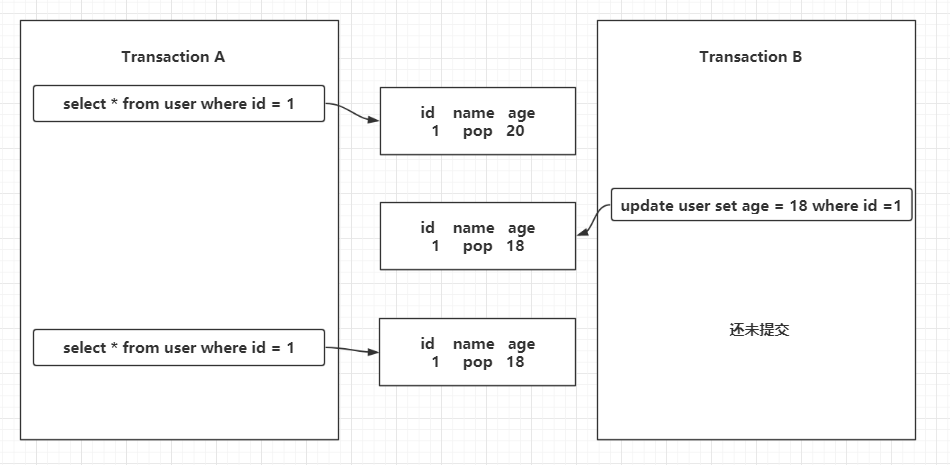
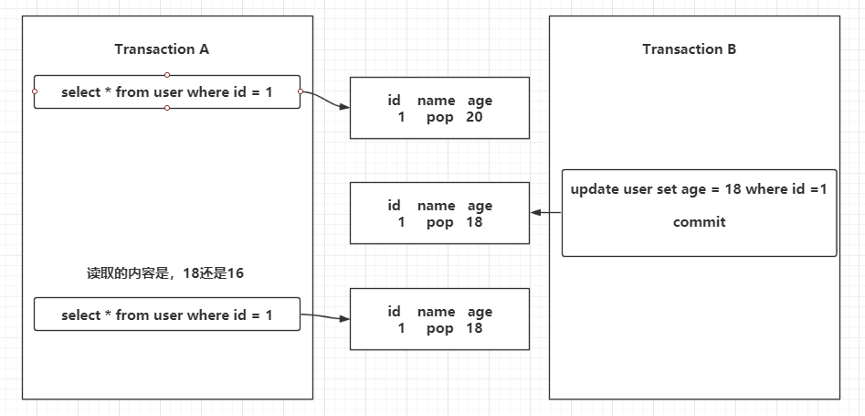
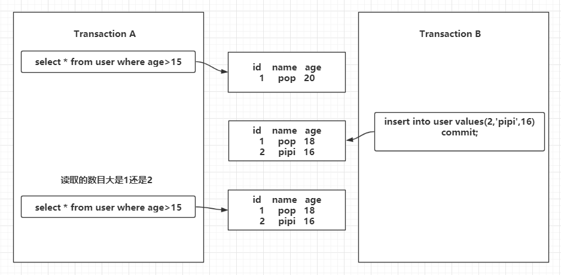
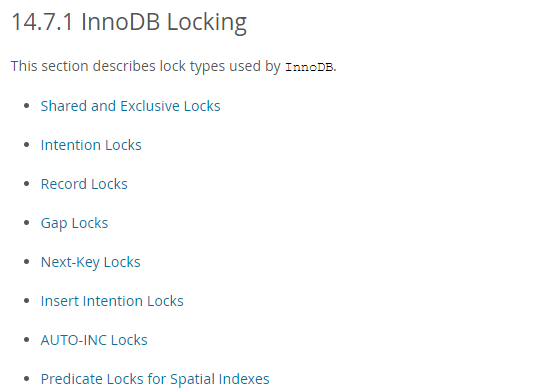
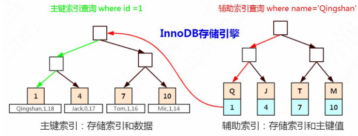
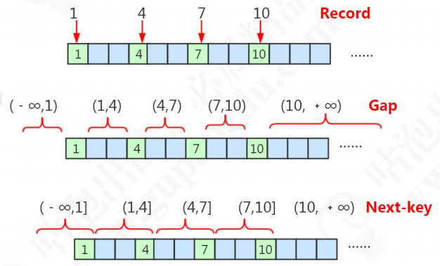

#### 锁与事务


##### 事务的定义

事务是数据库管理系统（DBMS）执行过程中的一个逻辑单位，由一个有限的数据库操作序列构成。

这里面有两个关键点，第一个，它是数据库最小的工作单元，是不可以再分的。第二个，它可能包含了一个或者一系列的 DML 语句，包括 insert delete update。（单条 DDL（create drop）和 DCL（grant revoke）也会有事务） 


##### 事务的四大特性

ACID

* 原子性，Atomicity，也就是我们刚才说的不可再分，也就意味着我们对数据库的一系列的操作，要么都是成功，要么都是失败，不可能出现部分成功或者部分失败的情况。以转账的场景为例，一个账户的余额减少，对应一个账户的增加，这两个一定是同时成功或者同时失败的。全部成功比较简单，问题是如果前面一个操作已经成功了，后面的操作失败了，怎么让它全部失败呢？这个时候我们必须要回滚。原子性，在 InnoDB 里面是通过 undo log 来实现的，它记录了数据修改之前的值（逻辑日志），一旦发生异常，就可以用 undo log 来实现回滚操作。

* 一致性，Consistent，指的是数据库的完整性约束没有被破坏，事务执行的前后都是合法的数据状态。比如主键必须是唯一的，字段长度符合要求。除了数据库自身的完整性约束。
  还有一个是用户自定义的完整性。比如说转账的这个场景，A 账户余额减少 1000，B 账户余额只增加了 500，这个时候因为两个操作都成功了，按照我们对原子性的定义，它是满足原子性的， 但是它没有 满足一致性，因为它导致了会计科目的不平衡。还有一种情况，A 账户余额为 0，如果这个时候转账成功了，A 账户的余额会变成 

  -1000，虽然它满足了原子性的，但是我们知道，借记卡的余额是不能够小于 0 的，所以 

  也违反了一致性。用户自定义的完整性通常要在代码中控制

* 隔离性，Isolation，我们有了事务的定义以后，在数据库里面会有很多的事务同时去操作我们的同一张表或者同一行数据，必然会产生一些并发或者干扰的操作，那么我们对隔离性的定义，就是这些很多个的事务，对表或者行的并发操作，应该是透明的，互相不干扰的。通过这种方式，我们最终也是保证业务数据的一致性。

* 持久性，Durable，事务的持久性是什么意思呢？我们对数据库的任意的操作，增删改，只要事务提交成功，那么结果就是永久性的，不可能因为我们系统宕机或者重启了数据库的服务器，它又恢复到原来的状态了。这个就是事务的持久性。

###### 持久性和数据库崩溃恢复（crash-safe）是通过什么实现的

持久性是通过 redo log 和 double write 双写缓冲来实现的。

之前说到我们在操作数据的时候会先记录一份到redo log来保证如果数据在写入的时候发生宕机等情况的时候来做数据恢复，当时如果在用来恢复的redolog本身被损坏了就没有意义，所以才会存在双写缓冲进行顺序写入来对这一页的数据进行备份。

会先写到内存的 buffer pool 里面，同时记录 redo log，如果在刷盘之前出现异常，在重启后就可以读取 redo log 的内容，写入到磁盘，保证数据的持久性。当然，恢复成功的前提是数据页本身没有被破坏，是完整的，这个通过双写缓冲 （double write）保证。 原子性，隔离性，持久性，最后都是为了实现一致性。


##### 据库什么时候出现事务

查看版本（5.7），存储引擎（InnnoDB），事务隔离级别（RR）。 

```sql
select version(); 
show variables like '%engine%'; 
show global variables like "tx_isolation";
```

只要你执行一条更新（update，insert，delete）就会存在事务，哪怕只是一个查询。

但是我们平时在navicat里面都没有感觉到事务的存在，起码不存在事务的开启和关闭的操作，这是因为InnoDB中存在`autocommit`的参数，有session和global两个级别。

```sql
show variables like 'autocommit';
```

如果显示的是`true/on`就表示会自动开启一个事务，和自动提交事务。

如果显示的是f`lase/off`就表示我们需要手动开启和关闭事务。

当然，你也可以手动开启一个事务，在你的语句开始之前写上 `begin`或者是 `start transaction`。

结束事务除去自动提交的之外有三种方法

* 提交事务 `commit`
* 回滚事务 `roback`
* 关闭客户端的连接，在navicat里面就是关闭那个用于写sql的窗口，事务也会结束。


##### 事务并发带来的问题

当很多事务并发地去操作数据库的表或者行的时候，如果没有我们刚才讲的事务的Isolation 隔离性的时候，会带来哪些问题呢？



有两个事务，A和B，在A事务里面，查询一条数据，同时另一个事务B通过修改改变了某一个值最后导致但是**却没有提交这条数据**，这条id为1的数据内容发生了改变，当事务A再次去查询这条数据的时候，发现数据已经和之前读取的不一致了。

这就是**脏读**，即第一次和第二次读取的数据内容不一致，因为其它的事务没有提交的原因。



和第一种情况同样是修改了同一条数据，但是事务B提交的事务。这种一个事务读取到了其他事务已提交的数据导致前后两次读取数据不一致的情 况，我们把它叫做**不可重复读**。



在第一个事务里面我们执行了一个范围查询，这个时候满足条件的数据只有一条。 在第二个事务里面，它插入了一行数据，并且提交了。重点：插入了一行数据。在第一个事务里面再去查询的时候，它发现多了一行数据。

一个事务前后两次读取数据数据不一致，是由于其他事务插入数据造成的，这种情况我们把它叫做**幻读**。 

###### 不可重复读和幻读的区别在哪里？

不可重复读是修改或者删除，幻读是插入，即查询两次数据不一致的原因是什么导致的。

###### 小结

刚刚说的是事务并发所带来的三大问题，无论是脏读，不可重复读，还是幻读，都是数据**读一致性**的问题，都是在一个事务里面前后两次读取出现不一致的情况。

读一致性的问题，数据库给出了解决方案。

##### SQL92 标准

这个标准是希望数据库的开发厂商按照这个标准，提供事务的隔离级别来解决事务的并发问题。

具体来看看这些事务的隔离级别。

* Read Uncommitted( 未提交读 )，一个事务的可以读取到其他未提交的事务，会出现脏读，也叫RU，它什么问题都没有解决。
* Read Committed （已提交读），一个事务已经读取到其他事务已经提交的数据，不能读取其他事务未提交的问题。
* Repeatable Read（可重复读），它解决不可以重复的问题，即一个事务里面多次读取相同的事务数据结果是一致的，但是没有解决幻读的问题。
* Serializable (串行化)，在这个隔离级别里面，所有的事务都是串行执行的，也就是命令都是按照顺序排列，数据的操作需要排队，已经不存在事务并发操作，所以解决了所有的问题。

Oracle里面就只有两种 RC（已提交读）和 Serializable （串行化）。


##### MySQL 在 InnoDB对隔离级别的支持

| 事务隔离级别                   | 脏读   | 不可重复读 | 幻读         |
| ------------------------------ | ------ | ---------- | ------------ |
| 未提交读写（Read Uncommitted） | 可能   | 可能       | 可能         |
| 已提交读（Read Committed）     | 不可能 | 可能       | 可能         |
| 可重复读（Repeatable Read）    | 不可能 | 不可能     | InnoDB下可能 |
| 串行化（Serializable）         | 不可能 | 不可能     | 不可能       |

InnoDB支持的四个隔离级别和SQL92定义的基本一致，隔离级别越高，事务并发度就越低，唯一的区别在于InnoDB在RR级别就解决了幻读的问题，这个也是InnoDB默认使用RR作为事务隔离级别的原因，既保证了数据的一致性，又支持较高的并发读。


###### 事务的嵌套

在Spring的体系里面，存在一种叫做事务属性，因为在业务代码中，我们有时候可能会存在事务嵌套的情况。

所谓的Spring事务的传播属性，就是定义在多个事务同时存在的时候，Spring应该如何处理这些事务的行为。这些属性在`TransactionDefinition`中定义。

| 常量                                                   | 解释                                                         |
| ------------------------------------------------------ | ------------------------------------------------------------ |
| PROPAGATION_REQUIRED（propagation_required）           | 支持当前事务，如果当前没有事务，就会创建一个事务，这是最常见的选择，也是Spring默认的传播属性 |
| PROPAGATION_REQUIRED_NEW (propagation_required_new)    | 新建事务，如果当前存在事务，就把当前事务挂起。新建的事务和被挂起的事务没有任何关系，是两个独立的事务。外部事务失败回滚之后，不能回滚内部事务执行的结果，内部事务失败抛出异常，被外部事务所捕获，也可以不做回滚操作 |
| PROPAGATION_SUPPORTS（propagation_supports）           | 支持当前事务，如果当前没有事务，就用非事务方式执行。即有就有，没有就没有，都支持你的决定。 |
| PROPAGATION_MANDATORY (propagation_mandatory（托管）)  | 支持当前事务，如果没有当前事务，就抛出异常                   |
| PROPAGATION_NOT_SUPPORTED（propagation_not_supported） | 以非事务方式执行操作，如果当前存在事务，就把当前的事务挂起   |
| PROPAGATION_NEVER（propagation_never）                 | 以非事务方式执行，如果当前存在事务，则抛出异常               |
| PROPAGATION_NESTED (propagation_nested(内嵌))          | 是比较复杂的一种模式。如果有活动事务，则运行在一个嵌套事务中。如果没有活动事务，则按照REQUIRED属性执行。它使用了当读的一个事务，这个事务拥有多个可以回滚的保存点。内部事务的回滚不会对外部事务造成影响。它只对DataSourceTransacationManager事务管理器起作用。 |


##### InnoDB中实现的隔离性的两大方案


* LBCC （Lock Based Concurrency Control）基于锁的并发控制既然要保证前后两次读取数据一致，那么我读取数据的时候，锁定我要 操作的数据，不允许其他的事务修改就行了

* MVCC（Multi Version Concurrency Control）那么我们可以在修改数据的时候给它建立一个备份或者叫快照，后面再来读取这个快照就行了。这种方案我们叫做多版本的并发控制

###### 单独说一下是MVCC

MVCC 的核心思想是： 我可以查到在我这个事务开始之前已经存在的数据，即使它在后面被修改或者删除了。在我这个事务之后新增的数据，我是查不到的。

InnoDB 为每行记录都实现了两个隐藏字段：

* DB_TRX_ID，6字节：插入或更新行的最后一个事务的事务ID，这是每条记录都有的，事务编码是自动递增（我们把它理解为创建版本号，在数据新增或者修改为新数据的时候，记录当前事务 ID）。
* DB_ROLL_PTR，7 字节：回滚指针（我们把它理解为删除版本号，数据被删除或记录为旧数据的时候，记录当前事务 ID）。 

这两个事务ID，可以理解为版本号。

例如，当我们开启一个事务

```sql
-- Transaction 1

begin;
insert into mvcctable values(1,'pop');
insert into mvcctable values(2,'pipi');
commit;
```

刚刚插入的数据，创建版本是当前的事务ID，删除版本为空，因为还有delete操作。

| id   | name | DB_TRX_ID（创建版本） | DB_ROLL_PTR(删除版本) |
| ---- | ---- | --------------------- | --------------------- |
| 1    | pop  | 1                     | undefined             |
| 2    | pipi | 1                     | undefined             |

第二个事务执行第一次查询，读取到两条原始的数据，这个时候事务ID是2

```sql
-- Transaction 2

begin;
select * from mvcctable --第一次查询
```

第三个事务，插入数据

```sql
-- Transaction 3

begin;
insert into mvcctable values(3,'papi');
commit;
```

因为这次多了一条数据，无论是查询还是更新都会产生事务，所以这边累积的事务编号变成了3

| id   | name | DB_TRX_ID（创建版本） | DB_ROLL_PTR(删除版本) |
| ---- | ---- | --------------------- | --------------------- |
| 1    | pop  | 1                     | undefined             |
| 2    | pipi | 1                     | undefined             |
| 3    | papi | 3                     | undefined             |

这个时候，我们再回到 `Transaction 2`情况

```sql
-- Transaction 2

begin;
select * from mvcctable --第二次查询
```

这个时候，在事务2里面再进行一次查询，会得到怎样的结果呢？

MVCC 的查找规则：**只能查找创建时间小于等于当前事务 ID 的数据，和删除时间大 于当前事务 ID 的行（或未删除）。** 

这个时候当前的事务中，也就是事务2里面的创建版本id为2，所有大于2的数据都是无法查询出来的，papi的事务id是3，所以仍然是两条数据。

同时第四个事务

```sql
-- Transaction 4
begin;
delete from mvcctable where id = 2;
commit;
```

删除了这个事务，此时pipi的删除版本当前事务ID变成了4，其它数据不变。

| id   | name | DB_TRX_ID（创建版本） | DB_ROLL_PTR(删除版本) |
| ---- | ---- | --------------------- | --------------------- |
| 1    | pop  | 1                     | undefined             |
| 2    | pipi | 1                     | 4                     |
| 3    | papi | 3                     | undefined             |

当你在第二个事务里面执行第三次查询的时候。

```sql
-- Transaction 2

begin;
select * from mvcctable --第三次查询
```

查找规则：**只能查找创建时间小于等于当前事务 ID 的数据，和删除时间大于当前事务 ID 的行（或未删除）**

在我事务开始之后删除的数据，所以 pipi 依然可以查出来。所以还是这两条数据。

第五个事务，执行更新操作，这个事务事务 ID 是 5

```sql
-- Transaction 4
begin;
update mvcctable set name = 'ccc' where id = 1;
commit;
```

此时的数据，更新数据的时候，旧数据的删除版本被记录为当前事务 ID 5（undo）,产生了一条新数据，创建 ID 为当前事务 ID 5： 

| id   | name | DB_TRX_ID（创建版本） | DB_ROLL_PTR(删除版本) |
| ---- | ---- | --------------------- | --------------------- |
| 1    | pop  | 1                     | 5                     |
| 2    | pipi | 1                     | 4                     |
| 3    | papi | 3                     | undefined             |
| 1    | ccc  | 5                     | undefined             |

此时我们再次回到第二个事务进行查询

```sql
-- Transaction 2

select * from mvcctable --第四次查询
```

查找规则：**只能查找创建时间小于等于当前事务 ID 的数据，和删除时间大于当前事务 ID 的行（或未删除）。**

由于transaction2中一直都是同一个事务，所以事务id始终是2，更新后的`‘ccc’`数据由于创建版本是大于2的，所以无法查询出来，因为按照规则，只能查询创建时间小于等于当前事务ID的数据。

又由于pop的删除版本大于2，是在事务2之后删除的，所以可以查询来。

通过以上演示我们能看到，通过版本号的控制，无论其他事务是插入、修改、删除，第一个事务查询到的数据都没有变化。

在 InnoDB 中，MVCC 是通过 Undo log 实现的。


##### MySQL 中 InnDB锁的基本类型

https://dev.mysql.com/doc/refman/5.7/en/innodb-locking.html



官网把锁分成了 8 类。所以我们把前面的两个行级别的锁（Shared and Exclusive Locks），和两个表级别的锁（Intention Locks）称为锁的基本模式。 后面三个 Record Locks、Gap Locks、Next-Key Locks，我们把它们叫做锁的算法，也就是分别在什么情况下锁定什么范围。

###### 锁的粒度

* 表锁，是锁住一张表
* 行锁，锁住一行数据

加锁效率，表锁大于行锁，因为表锁只要锁着这张表就可以，而行锁还需要找到这一行才能去锁住。

发生的冲突的概率，表锁大于行锁，锁住这张表后，任何事务都无法操作，锁住这行数据，其它事务还可以操作其它行的数据。也因为冲突概率表锁大于行锁，所以并发性，标锁会弱于行锁。


InnoDB 里面我们知道它既支持表锁又支持行锁，另一个常用的存储引擎 MyISAM 支 持什么粒度的锁？这是第一个问题。

第二个就是 InnoDB 已经支持行锁了，那么它也可以通过把表里面的每一行都锁住来实现表锁，为什么还要提供表锁呢？ 


###### 共享锁

第一个行级别的锁就是我们在官网看到的 Shared Locks （共享锁），我们获取了一行数据的读锁以后，可以用来读取数据，所以它也叫做读锁，注意不要在加上了读锁 以后去写数据，不然的话可能会出现**死锁**的情况。而且多个事务可以共享一把读锁。那怎么给一行数据加上读锁呢？

```sql
select .... lock in share mode; -- 这样的方式手工加上一把读锁
```

释放锁有两种方式，只要事务结束，锁就会自动事务，包括提交事务和结束事务。

我们也来验证一下，看看共享锁是不是可以重复获取。

| Transaction 1                                        | Transaction 2                                               |
| ---------------------------------------------------- | ----------------------------------------------------------- |
| begin;                                               |                                                             |
| select * from student where id =1 lock in shard mode |                                                             |
|                                                      | begin;                                                      |
|                                                      | select * from student where id =1 lock in shard mode; -- OK |


###### 排他锁

第二个行级别的锁叫做 Exclusive Locks（排它锁），它是用来操作数据的，所以又叫做写锁。只要一个事务获取了一行数据的排它锁，其他的事务就**不能再获取这一行数据的共享锁和排它锁。**

如何加上排他锁

* 第一种是自动加排他锁。我们在操作数据的时候，包括增删改，都会默认加上一个排它锁。
* 还有一种是手工加锁，我们用一个 FOR UPDATE 给一行数据加上一个排它锁，这个无论是在我们的代码里面还是操作数据的工具里面，都比较常用

释放锁有两种方式，只要事务结束，锁就会自动事务，包括提交事务和结束事务。

| Transaction 1                                 | Transaction 2                                                |
| --------------------------------------------- | ------------------------------------------------------------ |
| begin;                                        |                                                              |
| update student set sname = 'pop' where id = 1 |                                                              |
|                                               | begin;                                                       |
|                                               | select * from student where id =1 lock in shard mode; -- 共享锁排斥，所以阻塞<br />select * from student where id = 1 for update; -- 排他锁排斥，所以阻塞<br />delete from student where id = 1;-- 默认开启事务，包括增删改默认加上排他，所以排斥 |

这个是两个行锁，接下来就是两个表锁。


###### 意向锁

意向锁是由数据库自己维护的，我们给一行数据加上共享锁之后(行锁)，数据库会自动在这张表上加一个意向共享锁。

当我们给一行数据加上排他锁之前，数据库会自动在这张表上面加一个意向排他锁。

反过来说： 

如果一张表上面至少有一个意向共享锁，说明有其他的事务给其中的某些数据行加上了共享锁。 

如果一张表上面至少有一个意向排他锁，说明有其他的事务给其中的某些数据行加上了排他锁。

**意向共享锁和意向排他锁的意义**

* 我们有了表级别的锁，在 InnoDB 里面就可以支持更多粒度的锁。
* 如果说没有意向 锁的话，当我们准备给一张表加上表锁的时候，我们首先要做什么？是不是必须先要去 判断有没其他的事务锁定了其中了某些行？如果有的话，肯定不能加上表锁。那么这个 时候我们就要去扫描整张表才能确定能不能成功加上一个表锁，如果数据量特别大，比 如有上千万的数据的时候，加表锁的效率是不是很低？但是我们引入了意向锁之后就不一样了。我只要判断这张表上面有没有意向锁，如 果有，就直接返回失败。如果没有，就可以加锁成功。所以 InnoDB 里面的表锁，我们 可以把它理解成一个标志。就像火车上厕所有没有人使用的灯，是用来提高加锁的效率的。

| Transaction 1                                 | Transaction 2                                                |
| --------------------------------------------- | ------------------------------------------------------------ |
| begin;                                        |                                                              |
| update student set sname = 'pop' where id = 1 |                                                              |
|                                               | begin;                                                       |
|                                               | lock tables student write ; -- 锁表失败<br />unlock tables; // 释放表锁的方式 |

以上就是 MySQL 里面的 4 种基本的锁的模式，或者叫做锁的类型。


##### 行锁的原理

那么，锁到底锁住了什么呢？ 

当一个事务锁住了一行数据的时候，其他的事务不能操作这一行数据，那它到底是锁住了这一行数据，还是锁住了这一个字段，还是锁住了别的什么东西呢？ 

首先我们有三张表，一张没有索引的 **t1**，一张有主键索引的 **t2**，一张有唯一索引的 

**t3**。

###### 没有索引的表

t1是一张没有索引的表，我们先来看一下 t1 的表结构，它有两个字段，int 类型的 id 和 varchar 类型的 name。 里面有 4 条数据，1、2、3、4。 

| Transaction 1                             | Transaction 2                                           |
| ----------------------------------------- | ------------------------------------------------------- |
| begin;                                    |                                                         |
| select * from t1 where id = 1 for update; |                                                         |
|                                           | select * from t1 where id = 3 for update；<br />-- 阻塞 |
|                                           | insert into t1(id,name) values (5,'5');<br />-- 阻塞    |

在第一个事务里面，我们通过 where id =1 锁住第一行数据。 

在第二个事务里面，我们尝试给 id=3 的这一行数据加锁。很遗憾，我们看到红灯亮起，这个加锁的操作被阻塞了。这就有点奇怪了，第一个 事务锁住了 id=1 的这行数据，为什么我不能操作 id=3 的数据呢？ 我们再来操作一条不存在的数据，插入 id=5。它也被阻塞了。**实际上这里整张表都 被锁住了。所以，我们的第一个猜想被推翻了，InnoDB 的锁锁住的应该不是 Record**。

###### 有主键索引的表

我们看一下 t2 的表结构。字段是一样的，不同的地方是 id 上创建了一个主键索引。 里面的数据是 1、4、7、10。

| Transaction 1                             | Transaction 2                                            |
| ----------------------------------------- | -------------------------------------------------------- |
| begin;                                    |                                                          |
| select * from t2 where id = 1 for update; |                                                          |
|                                           | select * from t2 where id = 1 for update；<br />-- 阻塞  |
|                                           | select * from t2 where id = 4 for update；<br /> -- 通过 |

第一种情况，使用相同的 id 值去加锁，冲突；使用不同的 id 加锁，可以加锁成功。 那么，既然不是锁定一行数据，有没有可能是锁住了 id 的这个字段呢？


###### 唯一索引

我们看一下 t3 的表结构。字段还是一样的， id 上创建了一个主键索引，name 上 创建了一个唯一索引。里面的数据是 1、4、7、10。

| Transaction 1                                | Transaction 2                                             |
| -------------------------------------------- | --------------------------------------------------------- |
| begin;                                       |                                                           |
| select * from t3 where name= '4' for update; |                                                           |
|                                              | select * from t3 where name= '4' for update;<br />-- 阻塞 |
|                                              | select * from t2 where id = 4 for update；<br /> -- 阻塞  |

在第一个事务里面，我们通过 name 字段去锁定值是 4 的这行数据。 在第二个事务里面，尝试获取一样的排它锁，肯定是失败的，这个不用怀疑。 在这里我们怀疑 InnoDB 锁住的是字段，所以这次我换一个字段，用 id=4 去给这行 数据加锁。结果还是被阻塞了。

很明显，这三张表的差异在于索引的不同，导致了加锁行为的差异。


**为什么表里面没有索引的时候，锁住一行数据会导致锁表？**

* 如果我们定义了主键(PRIMARY KEY)，那么 InnoDB 会选择主键作为聚集索引。

* 如果没有显式定义主键，则 InnoDB 会选择第一个不包含有 NULL 值的唯一索 

  引作为主键索引。 

* 如果也没有这样的唯一索引，则 InnoDB 会选择内置 6 字节长的 ROWID 作 

  为隐藏的聚集索引，它会随着行记录的写入而主键递增。

所以，为什么锁表，是因为查询没有使用索引，会进行全表扫描，然后把每一个隐 

藏的聚集索引都锁住了。


**为什么通过唯一索引给数据行加锁，主键索引也会被锁住？** 

在辅助索引里面，索引存储的是二级索引和主键的值。比如name=4，存储的是name 

的索引和主键 id 的值 4。 而主键索引里面除了索引之外，还存储了完整的数据。所以我们通过辅助索引锁定 一行数据的时候，它跟我们检索数据的步骤是一样的，会通过主键值找到主键索引，然后也锁定。




##### 锁的算法

现在我们已经搞清楚 4 个锁的基本类型和锁的原理了，在官网上，还有 3 种锁，我们把它理解为锁的算法。我们也来看下 InnoDB 在什么时候分别锁住什么范围。

我们用主键索引加锁，我们这里的划分标准就是主键索引的值。



* Record。这些数据库里面存在的主键值，我们把它叫做 Record，记录，那么这里我们就有 4 个 Record

* Gap。根据主键，这些存在的 Record 隔开的数据不存在的区间，我们把它叫做 Gap，间 

  隙，它是一个**左开右开的区间**。 

* Next-key。最后一个，间隙（Gap）连同它左边的记录（Record），我们把它叫做临键的区间， 它是一个左开右闭的区间。

###### 记录锁

第一种情况，当我们对于唯一性的索引（包括唯一索引和主键索引）使用等值查询，精准匹配到一条记录的时候，这个时候使用的就是记录锁。比如 where id = 1 4 7 10 。 这个演示我们在前面已经看过了。我们使用不同的 key 去加锁，不会冲突，它只锁 住这个 record。

###### 间隙锁

第二种情况，当我们查询的记录不存在，没有命中任何一个 record，无论是用等值查询还是范围查询的时候，它使用的都是间隙锁。

当我们执行的条件有这样的内容，where id >4 and id <7，where id = 6。

| Transaction 1                            | Transaction 2                                                |
| ---------------------------------------- | ------------------------------------------------------------ |
| begin;                                   |                                                              |
|                                          | insert into t2(id,name) values(5,'5');--阻塞<br />insert into t2(id,name) values(6,'6');--阻塞<br />select * from t2 where id = 6 for update；--通过 |
| select * from t2 where id >20 for update |                                                              |
|                                          | insert into t2 (id,name) values(11.'11') -- 阻塞             |

重复一遍，当查询的记录不存在的时候，使用间隙锁

注意，间隙锁主要是阻塞插入 insert。相同的间隙锁之间不冲突。所以我们的范围查询并不会阻塞。

Gap Lock 只在 RR 中存在。如果要关闭间隙锁，就是把事务隔离级别设置成 RC， 并且把 `innodb_locks_unsafe_for_binlog` 设置为 ON。 这种情况下除了外键约束和唯一性检查会加间隙锁，其他情况都不会用间隙锁。


###### 临建锁

第三种情况，当我们使用了范围查询，不仅仅命中了 Record 记录，还包含了 Gap 间隙，在这种情况下我们使用的就是临键锁，它是 MySQL 里面默认的行锁算法，相当于记录锁加上间隙锁。

其他两种退化的情况： 

* 唯一性索引，等值查询匹配到一条记录的时候，退化成记录锁。 

* 没有匹配到任何记录的时候，退化成间隙锁。 

临键锁，锁住最后一个 key 的下一个左开右闭的区间。 

详细情况请见笔记


四个事务隔离级别的实现：

* Read Uncommited RU 隔离级别：不加锁。

* Serializable 
   Serializable 所有的 select 语句都会被隐式的转化为 select ... in share mode，会 

  和 update、delete 互斥。这两个很好理解，主要是 RR 和 RC 的区别？

* Repeatable ReadRR 隔离级别下，普通的 select 使用快照读(snapshot read)，底层使用 MVCC 来实 

  现。

  加锁的 select(select ... in share mode / select ... for update)以及更新操作 

  update, delete 等语句使用当前读（current read），底层使用记录锁、或者间隙锁、 

  临键锁。 

* Read CommitedRC 隔离级别下，普通的 select 都是快照读，使用 MVCC 实现。 

  加锁的 select 都使用记录锁，因为没有 Gap Lock。除了两种特殊情况——外键约束检查(foreign-key constraint checking)以及重复 键检查(duplicate-key checking)时会使用间隙锁封锁区间。 所以 RC 会出现幻读的问题。 


##### 死锁

###### 锁的释放与阻塞

事务结束（commit，rollback）；客户端连接断开。锁会释放。

如果一个事务一直未释放锁，其他事务会被阻塞多久？会不会永远等待下去？如果 是，在并发访问比较高的情况下，如果大量事务因无法立即获得所需的锁而挂起，会占 用大量计算机资源，造成严重性能问题，甚至拖跨数据库。

```sql
show VARIABLES like 'innodb_lock_wait_timeout'; -- 查看锁的超时时间
```

默认是50秒

