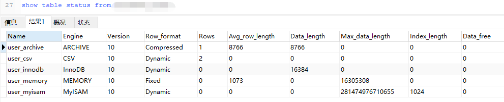
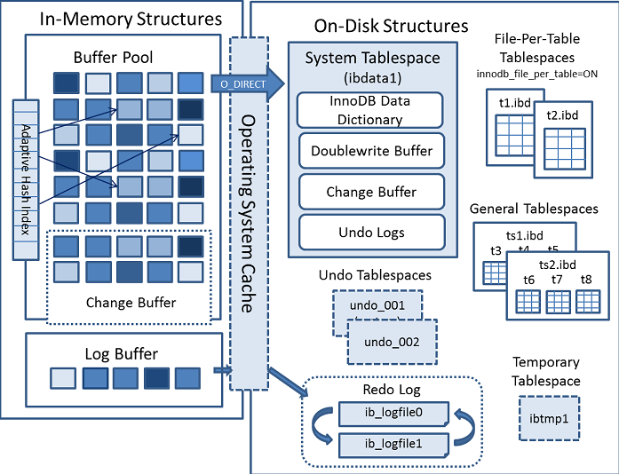

### MySql 性能优化

mysql 5.7的参考手册

https://dev.mysql.com/doc/refman/5.7/en/

#### MySql的发展历史和版本分支

| 时间          | 里程碑                                                       |
| ------------- | ------------------------------------------------------------ |
| 1996 年       | MySQL 1.0 发布。它的历史可以追溯到 1979 年，作者 Monty 用 BASIC 设计 的一个报表工具。 |
| 1996 年 10 月 | 3.11.1 发布。MySQL 没有 2.x 版本。                           |
| 2000 年       | ISAM 升级成 MyISAM 引擎。MySQL 开源。                        |
| 2003 年       | MySQL 4.0 发布，集成 InnoDB 存储引擎。                       |
| 2005 年       | MySQL 5.0 版本发布，提供了视图、存储过程等功能。             |
| 2008 年       | MySQL AB 公司被 Sun 公司收购，进入 Sun MySQL 时代。          |
| 2009 年       | Oracle 收购 Sun 公司，进入 Oracle MySQL 时代。               |
| 2010 年       | MySQL 5.5 发布，InnoDB 成为默认的存储引擎。                  |
| 2016 年       | MySQL 发布 8.0.0 版本。为什么没有 6、7？5.6 可以当成 6.x，5.7 可以当 |

#### MySql 中一条SQL语句是如何执行的


##### 通信

那么作为一个服务，如果要与它通信首先要建立一个连接才能与之交互，我们都知道MySql会默认开启一个3306的端口。除此之外我们还需要明白这个连接使用的是**通信协议**和**消息格式**各自是什么。

MySQL 是支持多种通信协议的，可以使用同步/异步的方式，支持长连接/短连接。 这里我们拆分来看。第一个是通信类型。

######  通信类型


一般来说，我们连接数据库都是同步连接。

###### 连接方式

这里的连接方式被分为尝试连接或者短连接，MySQL 既支持短连接，也支持长连接。短连接就是操作完毕以后，马上 close 掉。 长连接可以保持打开，减少服务端创建和释放连接的消耗，后面的程序访问的时候还可 以使用这个连接。一般我们会在连接池中使用长连接。

保持长连接会消耗内存。长时间不活动的连接，MySQL 服务器会断开。

```sql
show global variables like 'wait_timeout'; -- 非交互超时时间，如JDBC程序
show global variables like 'interactive_timeout'; -- 交互式超时时间，如数据库工具
```


这两个值默认都是 28800 秒，也就是 8个小时，也就是这个链接存活的时间，如果你连接数过大，可以考虑把这个连接超时时间调短一点，快点释放链接。

**如何查看MySql当前有多少个连接？**

```sql
show global status like 'Thread%';
```


* Threads_cached :  缓存中的线程连接数
* Threads_connected : 当前打开的连接数
* Threads_created : 为处理连接创建的线程数
* Threads_runing : 非睡眠状态的连接数，通常指并发连接数。

每产生一个连接或者一个会话，在服务端就会创建一个线程来处理。反过来，如果要杀死会话，就是 Kill 线程。

**如何知道当前连接的状态？**

```sql
show processlist; -- 有了连接数，查看当前连接的状态
```


这里需要说明的是，如果你是`root`用户，你可以查看所有的连接情况，但是你普通用户，就只能查看到你自己这个用户下的连接情况。

在查询结果的`Command`字段可以告诉我们当前的这个线程，也就是这个连接的状态。

更多关于`processlist`的介绍 : https://dev.mysql.com/doc/refman/5.7/en/show-processlist.html

更多关于`Command`的介绍 : https://dev.mysql.com/doc/refman/5.7/en/thread-commands.html

| 状态(Command)                | **含义**                                                     |
| ---------------------------- | ------------------------------------------------------------ |
| Sleep                        | 线程正在等待客户端，以向它发送一个新语句                     |
| Query                        | 线程正在执行查询或往客户端发送数据                           |
| Locked                       | 该查询被其它查询锁定                                         |
| Copying to tmp table on disk | 临时结果集合大于 tmp_table_size。线程把临时表从存储器内部格式改 变为磁盘模式，以节约存储器 |
| Sending data                 | 线程正在为 SELECT 语句处理行，同时正在向客户端发送数据       |
| Sorting for group            | 线程正在进行分类，以满足 GROUP BY 要求                       |
| Sorting for order            | 线程正在进行分类，以满足 ORDER BY 要求                       |

**MySql服务允许的最大连接数是多少？**

在 5.7 版本中默认是 151 个，最大可以设置成 16384（2^14）。但我这里查出来的是200，可能是版本不一样。

```sql
show variables like 'max_connections'; -- 查看最大连接数
```


**show的参数说明**

* show的后面部分如果你默认不加，级别是会话session级别的，即当前连接下有效，你可以增加global，这是全局级别。
* 关于修改，set，重启后将会失效；如果你希望永久生效，需要修改配置文件`/etc/my.cnf`

```sql
set global max_connections = 1000;
```

###### 通信方式


MySql使用了半双工的通信方式。

要么是客户端向服务端发送数据，要么是服务端向客户端发送数据，这两个动作不能 同时发生。所以客户端发送 SQL 语句给服务端的时候，（在一次连接里面）数据是不能 分成小块发送的，不管你的 SQL 语句有多大，都是一次性发送。 比如我们用 MyBatis 动态 SQL 生成了一个批量插入的语句，插入 10 万条数据，values 后面跟了一长串的内容，或者 where 条件 in 里面的值太多，会出现问题。 这个时候我们必须要调整 MySQL 服务器配置 `max_allowed_packet` 参数的值（默认 是 4M），把它调大，否则就会报错

```sql
show variables like 'max_allowed_packet'; -- 查看一次性允许发送多少数据
```


另一方面，对于服务端来说，也是一次性发送所有的数据，不能因为你已经取到了想 要的数据就中断操作，这个时候会对网络和内存产生大量消耗。 所以，我们一定要在程序里面避免不带 limit 的这种操作，比如一次把所有满足条件 的数据全部查出来，一定要先 count 一下。如果数据量的话，可以分批查询。


##### 查询缓存

缓存可以给查询带来效率的提升，但是mysql缓存默认是不开启的。

```sql
show variables like 'query_cache%'; -- 查看缓存情况
```


默认关闭的意思就是不推荐使用，为什么 MySQL 不推荐使用它自带的缓存呢？ 主要是因为 MySQL 自带的缓存的应用场景有限，第一个是它要求 SQL 语句必须一 模一样，中间多一个空格，字母大小写不同都被认为是不同的的 SQL。 第二个是表里面任何一条数据发生变化的时候，这张表所有缓存都会失效，所以对 于有大量数据更新的应用，也不适合。 所以缓存这一块，我们还是交给 ORM 框架（比如 MyBatis 默认开启了一级缓存）， 或者独立的缓存服务，比如 Redis 来处理更合适。 在 MySQL 8.0 中，查询缓存已经被移除了。


##### 解析器

我们知道，如果我们随便写一句话，数据库是会返回一个错误给我们的，那么为什么他可以知道我写的这一句话就是错误的呢？

这个就是 MySQL 的 `Parser` 解析器和 `Preprocessor` 预处理模块。 这一步主要做的事情是对语句基于 SQL 语法进行词法和语法分析和语义的解析。

例如这样一句话。

```sql
select name from user where id = 1;
```

它会打碎成 8 个符号，每个符号是什么类型，从哪里开始到哪里结束。

###### 语法解析

第二步就是语法分析，语法分析会对 SQL 做一些语法检查，比如单引号有没有闭合， 然后根据 MySQL 定义的语法规则，根据 SQL 语句生成一个数据结构。这个数据结构我 们把它叫做解析树（select_lex）。


```sql
select name from user_info where id =1 and age >20;
```

###### 预处理器

当我们词法和语法都正确的情况下，但是**表名或者字段不存在**，也同样会报错。解析器可以分析语法，但是它怎么知道数据库里面有什么表，表里面有什么字段呢？ 实际上还是在解析的时候报错，解析 SQL 的环节里面有个预处理器。 它会检查生成的解析树，解决解析器无法解析的语义。比如，它会检查表和列名是 否存在，检查名字和别名，保证没有歧义。 预处理之后得到一个新的解析树。


##### 查询优化(Query Optimizer) 与查询执行计划

当我们拿到了正确无误的解析树后，并不会马上开始执行语句，而是去尝试优化这条语句。

在mysql中存在一种**优化器**，他会为这条sql语句生成多条执行的方式，但是执行结果是一样的。当生产了多种的执行方案后，mysql的查询优化模块（Optimizer）也就是优化器，将会根据**预处理器**完成的解析树生成不同的执行计划（ExecutionPlan），然后选择一种最优的方案执行。

mysql里面使用的是基于开销（cost）的优化器，那种执行计划开销最小，就选用那个。

```sql
show status like 'Last_query_cost'; -- 查看查询的开销
```


https://dev.mysql.com/doc/refman/5.7/en/server-status-variables.html#statvar_Last_query_cost

```java
The total cost of the last compiled query as computed by the query optimizer. This is useful for comparing the cost of different query plans for the same query. The default value of 0 means that no query has been compiled yet. The default value is 0. Last_query_cost has session scope.

Last_query_cost can be computed accurately only for simple, “flat” queries, but not for complex queries such as those containing subqueries or UNION. For the latter, the value is set to 0.

/*
查询优化器计算的最后一个已编译查询的总成本。这对于比较相同查询的不同查询计划的成本非常有用。默认值0表示还没有编译任何查询。默认值是0。Last_query_cost具有会话范围。
Last_query_cost只能精确地计算简单的“平面”查询，而不能精确地计算包含子查询或联合的复杂查询。对于后者，值设置为0。
*/
```

**优化器对我们做了哪些优化。**

例如。

* 当我们对多张表进行关联查询的时候，以哪个表的数据作为基准表。 
* 有多个索引可以使用的时候，选择哪个索引。

《数据库查询优化器的艺术-原理解析与SQL性能优化》

但优化器并不是什么sql语句都可以优化，也不是每次都可以选择到最优的执行计划，主导权还是在我们手里。


**优化器是如何得到执行计划的**

https://dev.mysql.com/doc/internals/en/optimizer-tracing.html

首先我们需要启动优化器的追踪（默认是关闭的）

```sql
show variables like 'optimizer_trace'; -- 查看查询优化器是否开启
```


将他打开。

```sql
set optimizer_trace='enabled=on'; -- 开启查询优化器追踪器
set session optimizer_trace='enabled=off'; -- 上下等价，可以改成session或者global
```


注意开启这开关是会消耗性能的，因为它要把优化分析的结果写到表里面，所以不要轻易开启，或者查看完之后关闭它（改成 off）。

接着我们执行一条这样的语句

```sql
select a.`name`,c.`name` from user_archive a,user_csv c where c.id=a.id
```


这个时候优化器分析的过程已经记录到系统表里面了，我们可以查询：

```sql
select * from information_schema.OPTIMIZER_TRACE;
```


expanded_query 是优化后的 SQL 语句。 considered_execution_plans 里面列出了所有的执行计划。

分析完记得关掉它：

```sql
set optimizer_trace="enabled=off"; 
SHOW VARIABLES LIKE 'optimizer_trace';
```

你也可以在前方加上explain来看到执行计划，不过explain的结果也不一定是最终的执行结果。

```sql
EXPLAIN select a.`name`,c.`name` from user_archive a,user_csv c where c.id=a.id
```


##### 存储引擎

存储引擎将我们的数据存储起来，同时mysql中，每张表都可以拥有自己的存储结构，同时他们之前还可以还可以互相替换，所以也叫插件式的存储引擎，主要是为了满足不同的业务需求场景。

**查看存储引擎**

```sql
show table status from '数据库名'
```



**查看数据存放位置**

```sql
show variables like 'datadir'; -- 查看数据存放位置
```


###### 存储引擎比较

```sql
show ENGINES; -- 查看数据库对存储引擎的支持情况
```


其中有存储引擎的描述和对事务、XA 协议和 Savepoints 的支持。

* XA 协议用来实现分布式事务（分为本地资源管理器，事务管理器）。
* Savepoints 用来实现子事务（嵌套事务）。创建了一个 Savepoints 之后，事务就可以回滚到这个点，不会影响到创建 Savepoints 之前的操作。 

https://dev.mysql.com/doc/refman/5.7/en/storage-engines.html


##### 这些数据库支持的存储引擎，分别有什么特性

###### MyISAM 


一共三个文件。应用范围比较小。表级锁定限制了读/写的性能，因此在 Web 和数据仓库配置中， 

它通常用于只读或以读为主的工作。

* 支持表级别的锁（插入和更新会锁表）。不支持事务。
* 拥有较高的插入（insert）和查询（select）速度。 
* 存储了表的行数（count 速度更快）。

（怎么快速向数据库插入 100 万条数据？我们有一种先用 MyISAM 插入数据，然后 修改存储引擎为 InnoDB 的操作。）

**适合**：只读之类的数据分析的项目。


###### InnoDB


一共两个文件。mysql 5.7 中的默认存储引擎。InnoDB 是一个事务安全（与 ACID 兼容）的 MySQL 

存储引擎，它具有提交、回滚和崩溃恢复功能来保护用户数据。InnoDB 行级锁（不升级 为更粗粒度的锁）和 Oracle 风格的一致非锁读提高了多用户并发性和性能。InnoDB 将 用户数据存储在聚集索引中，以减少基于主键的常见查询的 I/O。为了保持数据完整性，InnoDB 还支持外键引用完整性约束。

* 支持事务，支持外键，因此数据的完整性、一致性更高。
* 支持行级别的锁和表级别的锁。
* 支持读写并发，写不阻塞读（MVCC）。
* 特殊的索引存放方式，可以减少 IO，提升查询效率。 

**适合**：经常更新的表，存在并发读写或者有事务处理的业务系统。


###### Memory


一共一個文件。将所有数据存储在 RAM 中，以便在需要快速查找非关键数据的环境中快速访问。这 

个引擎以前被称为堆引擎。其使用案例正在减少；InnoDB 及其缓冲池内存区域提供了一 种通用、持久的方法来将大部分或所有数据保存在内存中，而 ndbcluster 为大型分布式 数据集提供了快速的键值查找。

* 把数据放在内存里面，读写的速度很快，但是数据库重启或者崩溃，数据会全部消失。只适合做临时表

**适合**：将表中的数据存储到内存中。


###### CSV


一共三个文件。它的表实际上是带有逗号分隔值的文本文件。csv表允许以csv格式导入或转储数据， 以便与读写相同格式的脚本和应用程序交换数据。因为 csv 表没有索引，所以通常在正 常操作期间将数据保存在 innodb 表中，并且只在导入或导出阶段使用 csv 表。

* 不允许空行，不支持索引。格式通用，可以直接编辑，适合在不同数据库之间导入导出。


###### Archive


一共两个文件。这些紧凑的未索引的表用于存储和检索大量很少引用的历史、存档或安全审计信息。

* 不支持索引，不支持 update delete。


这是 MySQL 里面常见的一些存储引擎，我们看到了，不同的存储引擎提供的特性都 不一样，它们有不同的存储机制、索引方式、锁定水平等功能。 我们在不同的业务场景中对数据操作的要求不同，就可以选择不同的存储引擎来满 足我们的需求，这个就是 MySQL 支持这么多存储引擎的原因。


###### 如何选择存储引擎

* 对数据一致性要求比较高，需要事务支持，可以选择 InnoDB。
* 数据查询多更新少，对查询性能要求比较高，可以选择 MyISAM。
* 需要一个用于查询的临时表，可以选择 Memory。

所有的存储引擎都不能满足你的需求，并且技术能力足够，可以根据官网内部 手册用 C 语言开发一个存储引擎：https://dev.mysql.com/doc/internals/en/custom-engine.html


##### 执行引擎（Query Execution Engine）

把数据返回给客户端，即使没有结果也要返回。


#### 一条更新SQL是如何执行的

在数据库里面，我们说的 update 操作其实包括了更新、插入和删除。如果大家有看 过 MyBatis 的源码应该知道 Executor 里面也只有 doQuery()和 doUpdate()的方法， 没有 doDelete()和 doInsert()。

基本流程也是一致的，也就是说，它也要经过解析器、优化器的处理，最后交给执行器。区别就在于拿到符合条件的数据之后的操作。

##### 缓冲池 Buffer Pool

首先，InnnoDB 的**数据**都是放在磁盘上的，InnoDB 操作数据有一个最小的逻辑单 位，叫做**页**（索引页和数据页）。我们对于数据的操作，不是每次都直接操作磁盘，因 为磁盘的速度太慢了。InnoDB 使用了一种缓冲池的技术，也就是把磁盘读到的页放到一 块内存区域里面。这个内存区域就叫 `Buffer Pool`。


当要操作数据的时候，会先去看看buffer pool中是否有想要操作的数据，这里是一页(page)一页的查找，页上面存储从dbfile上读取来的数据，如果存在就直接修改，否则就访问磁盘，加载进bufferpool

**修改**数据的时候，先修改缓冲池里面的页。内存的数据页和磁盘数据不一致的时候， 我们把它叫做**脏页**。InnoDB 里面有专门的后台线程把 Buffer Pool 的数据写入到磁盘， 每隔一段时间就一次性地把多个修改写入磁盘，这个动作就叫做**刷脏**。

Buffer Pool 是 InnoDB 里面非常重要的一个结构，它的内部又分成几块区域。这里我们趁机到官网来认识一下 InnoDB 的内存结构和磁盘结构。

https://dev.mysql.com/doc/refman/5.7/en/innodb-architecture.html



###### 内存结构

Buffer Pool 主要分为 3 个部分： `Buffer Pool`、`Change Buffer`、`Adaptive Hash Index`，另外还有一个`（redo）log buffer`。

###### Buffer Pool

Buffer Pool 缓存的是页面信息，包括数据页、索引页。查看服务器状态，里面有很多跟 Buffer Pool 相关的信息：

```sql
show status like '%innodb_buffer_pool%' -- 查看服务器上 buffer pool 相关信息
```


```sql
show variables like '%innodb_buffer_pool%'; -- 查看 buffer pool 的系统参数
```


Buffer Pool 默认大小是 128M（134217728 字节），可以调整。

###### 内存的缓冲池写满了怎么办？

（Redis 设置的内存满了怎么办？）InnoDB 用 LRU 算法来管理缓冲池（链表实现，不是传统的 LRU，分成了 young 和 old），经过淘汰的 数据就是热点数据。


###### Change Buffer 写缓冲

当需要更新一个数据页时，如果数据页在 Buffer Pool 中存在，那么就直接更新好了。 否则的话就需要从磁盘加载到内存，再对内存的数据页进行操作。也就是说，如果 没有命中缓冲池，至少要产生一次磁盘 IO，有没有优化的方式呢？ 

如果这个数据页不是唯一索引，就不存在数据重复的情况，也就不需要从磁盘加载索 引页判断数据是不是重复（唯一性检查）。这种情况下可以先把修改记录在内存的缓冲 池中，从而提升更新语句（Insert、Delete、Update）的执行速度。

这一块区域就是 Change Buffer。5.5 之前叫 Insert Buffer 插入缓冲，现在也能支 持 delete 和 update。

最后把 Change Buffer 记录到数据页的操作叫做 merge。什么时候发生 merge？ 有几种情况：在访问这个数据页的时候，或者通过后台线程、或者数据库 shut down、 redo log 写满时触发。

如果数据库大部分索引都是非唯一索引，并且业务是**写多读少**，不会在写数据后立刻读取，就可以使用 Change Buffer（写缓冲）。写多读少的业务，调大这个值：

```sql
show variables like 'innodb_change_buffer_max_size'; -- 查看写缓冲的值，单位是 buffer pool的百分比
```


代表 Change Buffer 占 Buffer Pool 的比例，默认 25%。


###### **Adaptive Hash Index**

把一种哈希的索引放到内存


###### （redo） Log Buffer

如果 Buffer Pool 里面的脏页还没有刷入磁盘时，数据库宕机或者重启，这些数据丢失。如果写操作写到一半，甚至可能会破坏数据文件导致数据库不可用。为了避免这个问题，InnoDB 把所有对页面的修改操作专门写入一个日志文件，并且 在数据库启动时从这个文件进行恢复操作（实现 crash-safe）——用它来实现事务的持 久性。


##### 磁盘空间


