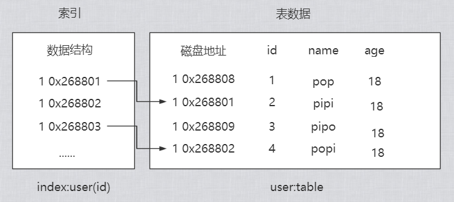
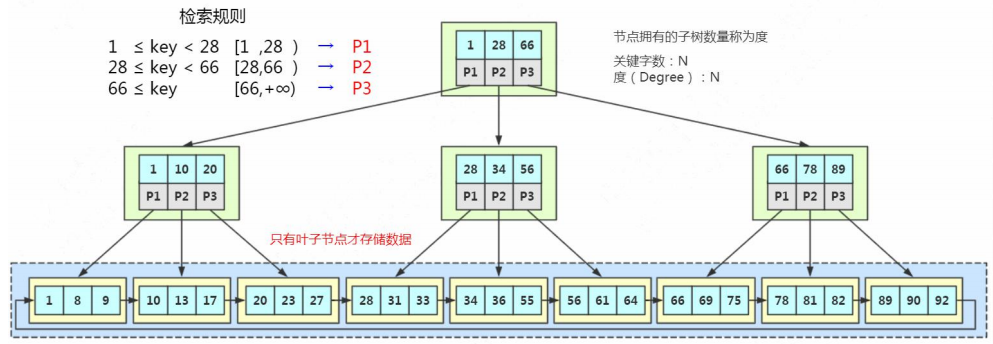
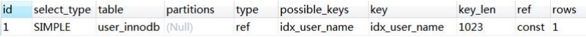

### 索引

---


##### 索引是什么

数据库索引，是数据库管理系统（DBMS）中一个排序的数据结构，以协助快速查询、 更新数据库表中数据。

广义上来说，索引可以比作一本字段的目录，又或者是便签，你可以通过查询目录或者便签从而缩小查找的范围，并且快速获得想要的数据。



首先数据是以文件的形式存放在磁盘上面的，每一行数据都有它的磁盘地址。如果 没有索引的话，要从 500 万行数据里面检索一条数据，只能依次遍历这张表的全部数据， 直到找到这条数据。 但是有了索引之后，只需要在索引里面去检索这条数据就行了，因为它是一种特殊 的专门用来快速检索的数据结构，我们找到数据存放的磁盘地址以后，就可以拿到数据了。


##### 索引类型

我们可以通过navicat的ui界面又或者命令创造一个索引。


第一个是索引的名称，第二个是索引的列，比如我们是要对 id 创建索引还是对 name 创建索引。后面两个很重要，一个叫**索引类型**。

我们现在要说的是`InnoDB`这种存储引擎的情况。总共有三种索引引擎。

* 普通索引（Normal）：也叫非索引，是最普通的索引，没有任何的限制。
* 唯一索引（Unique）：唯一索引要求键值不能重复。另外需要注意的是，主键索引是一种特殊的唯一索引，它还多了一个限制条件，要求键值不能为空。主键索引引用primay key 创建。
* 全文索引（Fulltext）：针对比较大的数据，比如我们存放的消息内容，有几kb的数据这种情况，如果要解决like查询效率低下的问题，可以创建全文索引。只有文本类型的字段才可以创建全文索引。比如char、varchar、text。

```sql
create table table_name(
	name varchar(64),
	fulltext index(name)
)
```

全文索引的使用：

```sql
select * from table_name where match(content) against('pop'IN NATURAL LANGUAGE MODE)
```

另外，MyISAM 和 InnoDB支持全文索引。


##### 索引的存储衍化

https://www.cs.usfca.edu/~galles/visualization/Algorithms.html

###### 二分查找

如果一个猜价格的游戏，猜一猜一件物品多少钱，有若干次机会。

那么首先你会给出一个你觉得合适的值，例如5000，然后给出提示低了。

接着你又给出一个值，例如10000，提示说高了。那么答案就是5000-10000之间。

这个时候你给出的价格应该是越能缩小范围的值是最合适也是最快找到答案的方法。

我们可以对半查找。你不会猜9999也不会猜5001而是应该猜7500，再不断缩小范围。


这其实就是二分查找的一种思想，也叫折半查找，每一次，我们都把候选数据缩 小了一半。如果数据已经**排过序**的话，这种方式效率比较高。

所以第一个，我们可以考虑用**有序数组**作为索引的数据结构。有序数组的等值查询和比较查询效率非常高，但是更新数据的时候会出现一个问题， 可能要挪动大量的数据（改变 index），所以只适合存储静态的数据。 

为了支持频繁的修改，比如插入数据，我们需要采用**链表**。链表的话，如果是单链表，它的查找效率还是不够高。

所以，有没有支持二分查找的链表呢？


###### 二叉查找树 （BST Binary Search Tree）

* 左子树所有节点都小于父节点。
* 右子树所有节点都大于父节点
* 投影到平面以后，就是一个有序的线性表。


二叉查找树既能够实现快速查找，又能够实现快速插入。 

但是二叉查找树有一个问题： 

就是它的查找耗时是和这棵树的深度相关的，在最坏的情况下时间复杂度会退化成O(n)。

我们刚刚插入的是无序的一批数字，如果我们插入一串有序的数字我们看看这个二叉查找树会变成什么样子。


很显然，这个也是符合二叉查找树的规则的，即左子树小于父节点，右子数大于父节点。在插入的时候，二叉查找树会根据最先插入的数值最为基准，例如此案例就是以2最为基准，因为他是第一次插入的值，根据要插入的数值与父节点判断大小来决定走左右哪个分支进行插入。

它会变成链表（我们把这种树叫做“斜树”），这种情况下不能达到加快检索速度的目的，和顺序查找效率是没有区别的。 

因为左右子树深度差太大，这棵树的左子树根本没有节点——也就是它不够平衡。所以，我们有没有左右子树深度相差不是那么大，更加平衡的树呢？


###### 平衡二叉树 （AVL Tree Balanced binary search trees） （左旋、右旋）

平衡二叉树的定义：左右子树深度差绝对值不能超过 1。

意思就是，左子树的深度是 2，右子树的深度只能是 1 或者 3

我们按照之前二叉查找树的插入规则，来尝试插入平衡二叉树 `1 2 3 4 5 6`，看看是什么样子。


这是插入1 和 2的样子。当我们插入3的时候。


会变成这个样子，同时我们主要到每个节点上都有奇怪的数字，这个先放一下，然后就是神奇的事情。


1 号节竟然往下走了，不如说整个树以2号节点为中心**左旋**了。因为它是右节点下面接一个右节点，**右-右型**，所以这个时候我们要把 2 提上去，这个操作叫做**左旋**。

同样的，如果我们插入 7、6、5，这个时候会变成左左型，就会发生**右旋**操作，把 6 提上去。 


连续插入左边，所以是左左形，**右旋**。

所以为了保持平衡，AVL 树在插入和更新数据的时候执行了一系列的计算和调整的操作。

到此平衡的问题我们解决了，接下来就是用AVL树来作为索引来查询数据。

在平衡二叉树中，一个节点，它的大小是一个固定的单位，关键是具体存储什么样的内容。

* 是索引的键值。例如我们在id上面创建了一个索引，在使用`where id = 1`的条件查询的时候就会找到索引里面的id的这个键值。
* 数据的磁盘地址，因为索引的引用就是查找数据存放的地址。
* 因为是二叉树，它必须还要有左子节点和右子节点的引用，这样我们才能找到下一个节点。比如大于30，走右边，到下一个树的节点，继续判断。

所以，看起来，应该是下面这个样子。


如果是这样存储数据的话，我们来看一下会有什么问题。

在分析用 AVL 树存储索引数据之前，我们先来学习一下 InnoDB 的逻辑存储结构。

**InnoDB 逻辑存储结构**

https://dev.mysql.com/doc/refman/5.7/en/innodb-disk-management.html 

https://dev.mysql.com/doc/refman/5.7/en/innodb-file-space.html

MySQL 的存储结构分为 5 级：表空间、段、簇、页、行。


也就是InnoDB存储引擎实际存储数据的逻辑是怎样的

**表空间 Table Space**

表空间可以看做是 InnoDB 存储引擎逻辑结构的 最高层，所有的数据都存放在表空间中。分为：系统表空间、独占表空间、通用表空间、 临时表空间、Undo 表空间

**段 Segment**

表空间是由各个段组成的，常见的段有数据段、索引段、回滚段等，段是一个逻辑 

的概念。一个 ibd 文件（独立表空间文件）里面会由很多个段组成。 创建一个索引会创建两个段，一个是索引段：`leaf node segment`，一个是数据段： `non-leaf node segment`。索引段管理非叶子节点的数据。数据段管理叶子节点的数据。 也就是说，一个表的段数，就是索引的个数乘以 2。

**簇 Extent**

一个段（Segment）又由很多的簇（也可以叫区）组成，每个区的大小是 1MB（64 

个连续的页）。 每一个段至少会有一个簇，一个段所管理的空间大小是无限的，可以一直扩展下去， 但是扩展的最小单位就是簇。

**页 Page**

为了高效管理物理空间，对簇进一步细分，就得到了页。簇是由连续的页（Page） 

组成的空间，一个簇中有 64 个连续的页。 （1MB／16KB=64）。这些页面在物理上和 

逻辑上都是连续的。 跟大多数数据库一样，InnoDB 也有页的概念（也可以称为块），每个页默认 16KB。 页是 InnoDB 存储引擎磁盘管理的最小单位，通过 `innodb_page_size` 设置。 

一个表空间最多拥有 2^32 个页，默认情况下一个页的大小为 16KB，也就是说一个 表空间最多存储 64TB 的数据。


1  簇（区）* 1mb= 64  页，所以 1 页 = 1024 kb/64  = 16kb。

注意，文件系统中，也有页的概念。操作系统和内存打交道，最小的单位是页 Page。文件系统的内存页通常是 4K。


```sql
show VARIABLES like 'innodb_page_size'; -- 查询 innodb 里面的页的大小
```


假设一行数据大小是 1K，那么一个数据页可以放 16 行这样的数据。

###### AVL 树用于存储索引数据、

```sql
select concat(round(sum(DATA_LENGTH/1024/1024),2),'mb') as data_len,
concat(round(sum(index_length/1024/1024),2),'mb') as index_len from information_schema.`TABLES`
where TABLE_SCHEMA='数据库名' and TABLE_NAME='表名';
```


当我们用树的结构来存储索引的时候，访问一个节点就要跟磁盘之间发生一次 IO。 InnoDB 操作磁盘的最小的单位是一页（或者叫一个磁盘块），大小是 16K(16384 字节)。 

那么，一个树的节点就是 16K 的大小。 

如果我们一个节点只存一个键值+数据+引用，例如整形的字段，可能只用了十几个 或者几十个字节，它远远达不到 16K 的容量，所以访问一个树节点，进行一次 IO 的时候， 浪费了大量的空间。

所以如果每个节点存储的数据太少，从索引中找到我们需要的数据，就要访问更多 的节点，意味着跟磁盘交互次数就会过多。 如果是机械硬盘时代，每次从磁盘读取数据需要 10ms 左右的寻址时间，交互次数 越多，消耗的时间就越多。


比如上面这张图，我们一张表里面有 6 条数据，当我们查询 id=37 的时候，要查询两个子节点，就需要跟磁盘交互 3 次，如果我们有几百万的数据呢？这个时间更加难以 估计

解决方案是

* 我们可以让每个节点存储更多的数据
* 节点上的关键字越多，我们的指针数也就越多，也就是引用其他节点的指向越多，意味着会有更多的分叉（这里称呼为“路数”）

所以，因为分叉越多，存储的数据多了，代表树的**深度**就会介绍，根节点深度是0.

这样，我们的树是不是从原来的高瘦高瘦的样子，变成了矮胖矮胖的样子？

这个时候，我们的树就不再是二叉了，而是多叉，或者叫做多路。


###### 多路平衡查找树 （B Tree Balanced Tree） （分裂、合并）

这个就是我们多路平衡查找树，就做B Tree。b 代表平衡

跟 AVL 树一样，B 树在根节点和叶子节点存储键值、数据地址、节点引用。

特点

* 分叉数（路数）永远比关键字数多 1。

比如我们画的这棵树，每个节点存储两个关键字，那么就会有三个指针指向三个子节点。


比如我们要在这张表里面查找 15。 

因为 15 小于 17，走左边。 也就是走了0x02的方向，有因为15大于12，走右边，走了0x07方向，最后在磁盘7里面找打了15，总共**3**次IO

那么 B tree 的效率是不是比AVL树要高呢，相对来说，他减少了IO的次数，应该是高了点的，那么B tree如何实现一个节点存储多个关键字，还保持平衡的呢？跟 AVL 树有什 么区别？ 

比如在 Max Degree（路数）是 3 的情况下，我们插入数据 1 2 3。看看会发生什么


把中间的数据 2 提上去，把 1 和 3 变 成 2 的子节点，这样关键字就变成1，路数就变成了2，符合B tree的规范。

如果删除节点，会有相反的合并的操作。注意这里是分裂和合并，跟 AVL 树的左旋和右旋是不一样的。

插入4 和 5也会有分裂和合并的操作


从这个里面我们也能看到，在更新索引的时候会有大量的索引的结构的调整，所以 解释了为什么我们不要在**频繁更新的列上建索引**，或者为什么**不要更新主键**。 

节点的分裂和合并，其实就是 InnoDB 页的分裂和合并。


###### B + 树 （加强版多路平衡查找树）

这个 B 树的改良版本解决的问题比 B Tree 更全面，他的结构是这样的。



这个结构的关键在于，真正的数据只存在在叶子节点，也就是末端节点，其他的节点都只存放键值和引用。并且所以子节点都保存了前后的引用，所以还是一个有序链表，查找时不需要再从父节点做返回查找，直接根据链表就可以找到。

他的特点。

* 它的关键字的数量根路数是相等的。
* B+ Tree的根节点和枝节点中都不会存储数据，只有叶子节点才存储数据。搜索到关键字不会直接返回，会到最后一层的叶子节点，这就保证了每一次查找的稳定性，所有查找的所经过的流程是**一视同仁**的。

如果我们要查找id=66，虽然第一层已经命中了索引，但是由于完整的数据并不在非叶子节点上，所以你还需要往下查找。

那么B+树的优势在哪里呢？

假设如果一条记录1KB=16384byte，我们知道innodb中一页是16KB，也就是一页可以存储16条这样的数据。存储数据的是在b+tree里是叶子节点，那么如果是只存储指针和键值的非叶子节点可以存储多少个（指针+键值）呢？

假设索引的字段是bigint类型，长度为8byte。指针大小在innodb源码中设置为6字节，所以就是8+6=14byte。非叶子节点代表的是一页，所以一个非叶子节点可以存储16384/14=1170个这样大小的指针。

在树的深度为2的情况下，一个指针代表了一个分叉也就是一路，第一层是1170分支，到了第二层就是1170*1170，这是深度为2时，会有这么多的叶子节点。再乘以每个叶子节点按照一页可以存储16条数据来计算。那么深度为2的时候，总共可以存储1170*1170*16=21912400.


在查找数据时一次页的查找代表一次 IO，也就是说，一张 2000 万左右的表，查询 数据最多需要访问 3 次磁盘。 

所以在 InnoDB 中 B+ 树深度一般为 1-3 层，它就能满足千万级的数据存储。

B+树的数据搜寻过程

* 比如我们要查找 28，在根节点就找到了键值，但是因为它不是页子节点，所以 

会继续往下搜寻，28 是[28,66)的左闭右开的区间的临界值，所以会走中间的子节点，然 

后继续搜索，它又是[28,34)的左闭右开的区间的临界值，所以会走左边的子节点，最后 

在叶子节点上找到了需要的数据。

* 如果是范围查询，比如要查询从 22 到 60 的数据，当找到 22 之后，只 

  需要顺着节点和指针顺序遍历就可以一次性访问到所有的数据节点，**这样就极大地提高**了区间查询效率（不需要返回上层父节点重复遍历查找）。

B+树的总结

* 它是 B Tree 的变种，B Tree 能解决的问题，它都能解决。B Tree 解决的两大问题 

  是什么？（每个节点存储更多关键字；路数更多）

* 扫库、扫表能力更强（如果我们要对表进行全表扫描，只需要遍历叶子节点就可以 

  了，不需要遍历整棵 B+Tree 拿到所有的数据）

* 排序能力更强（因为叶子节点上有下一个数据区的指针，数据形成了链表）
* 效率更加稳定（B+Tree 永远是在叶子节点拿到数据，所以 IO 次数是稳定的） 


###### 为什么不用红黑树

红黑树也是 BST 树，但是不是严格平衡的。

必须满足 5 个约束： 

* 节点分为红色或者黑色。
* 根节点必须是黑色的。
* 叶子节点都是黑色的 NULL 节点。
* 红色节点的两个子节点都是黑色（不允许两个相邻的红色节点）。
* 从任意节点出发，到其每个叶子节点的路径中包含相同数量的黑色节点。

插入：60、56、68、45、64、58、72、43、49


基于以上规则，可以推导出：

为什么不用红黑树、

* 只有两路
* 不够平衡

红黑树一般只放在内存里面用。例如 Java 的 TreeMap


##### B+Tree 在Mysql中的具体体现

MySQL 是一个支持插件式存储引擎的数据库。在 MySQL 里面，每个表在创建的时候都可以指定它所使用的存储引擎。这里我们主要关注一下最常用的两个存储引擎，MyISAM 和 InnoDB 的索引的实现。

```sql
show VARIABLES like 'datadir';
```

mysql会在响应data文件夹下创建和数据库同名的文件夹，在文件夹下会根据不同的存储引擎，产生不同数量的文件。


在这里我们能看到，每张 InnoDB 的表有两个文件（.frm 和.ibd），MyISAM 的表有三个文件（.frm、.MYD、.MYI）

有一个是相同的文件，.frm。 .frm 是 MySQL 里面表结构定义的文件，不管你建表的时候选用任何一个存储引擎都会生成。所以我们来看其它两个文件是怎么实现MySql不同的存储引擎的索引的。

###### MyISAM


* 一个是.MYD 文件，D 代表 Data，是 MyISAM 的数据文件，存放数据记录，比如我 

  们的 user_myisam 表的所有的表数据。

* 一个是.MYI 文件，I 代表 Index，是 MyISAM 的索引文件，存放索引，比如我们在 

  id 字段上面创建了一个主键索引，那么主键索引就是在这个索引文件里面。

也就是说，在 MyISAM 里面，索引和数据是两个独立的文件。

MyISAM 的 B+Tree 里面，叶子节点存储的是数据文件对应的磁盘地址。所以从索引文件.MYI 中找到键值后，会到数据文件.MYD 中获取相应的数据记录。


这里是主键索引，如果是辅助索引，有什么不一样呢？在 MyISAM 里面，辅助索引也在这个.MYI 文件里面。

除了主键索引，其它都是辅助索引，或者叫二级索引，辅助索引跟主键索引存储和检索数据的方式是没有任何区别的，一样是在索引文件里面找到磁盘地址，然后到数据文件里面获取数据。


请记住，MyISAM的数据本体和索引是分开存储的，主键索引和辅助索引位于同一个文件MYI中。


###### InnoDB


在 InnoDB 里面，它是以主键为索引来组织数据的存储的，所以索引文件和数据文 件是同一个文件，都在.ibd 文件里面

在 InnoDB 的主键索引的叶子节点上，它直接存储了我们的数据。


和我们之前讲的b+tree是一个意思。

###### 什么叫做聚集索引（聚簇索引）？

**就是索引键值的逻辑顺序跟表数据行的物理存储顺序是一致的**。（比如字典的目录 是按拼音排序的，内容也是按拼音排序的，按拼音排序的这种目录就叫聚集索引）。 在 InnoDB 里面，它组织数据的方式叫做叫做（聚集）索引组织表（clustered index organize table），所以主键索引是聚集索引，**非主键都是非聚集索引**。 如果 InnoDB 里面主键是这样存储的，那主键之外的索引，比如我们在 name 字段 上面建的普通索引，又是怎么存储和检索数据的呢？


InnoDB 中，主键索引和辅助索引是有一个主次之分的。

辅助索引存储的是辅助索引和主键值。如果使用辅助索引查询，会根据主键值在主 键索引中查询，最终取得数据。

比如我们用 name 索引查询 name= '青山'，它会在叶子节点找到主键值，也就是id=1，然后再到主键索引的叶子节点拿到数据。 为什么在辅助索引里面存储的是主键值而不是主键的磁盘地址呢？如果主键的数据类型比较大，是不是比存地址更消耗空间呢？

其实还一个原因是，B Tree是实现了一个节点存放了多个关键字还保持了平衡，主要是有分裂和合并的能力，这个过程中键值的地址会发生变化，如果你在辅助索引里面存放了地址，那就会有问题了，所以存储主键值是最为妥当的。

那么，我们之前说了innoDB中会存在主键索引，那么存不存在一张表没有主键的情况呢？

###### 一张表没有主键怎么办？

* 如果我们定义了主键(PRIMARY KEY)，那么 InnoDB 会选择主键作为聚集索引。

* 如果没有显式定义主键，则 InnoDB 会选择第一个不包含有 NULL 值的唯一索引（unique）作为主键索引。 

* 如果也没有这样的唯一索引，则 InnoDB 会选择内置 6 字节长的 ROWID 作为隐 

  藏的聚集索引，它会随着行记录的写入而主键递增。

```sql
select _rowid name from t2;
```


##### 索引使用原则

我们容易有以一个误区，就是在经常使用的查询条件上都建立索引，索引越多越好。


###### 列的离散度

第一个叫做列的离散度，我们先来看一下列的离散度的公式： 

```
count(distinct(column_name)) : count(*) 列的全部不同值和所有数据行的比例
```

数据行数相同的情况下，分子越大，列的离散度就越高。


例如，name的数据，重复的很少，所以分子很大，导致离散度高

gender的重复很多，分子小，也就是2，所以离散度就偏小，phone也是这个道理。

简单来说，如果列的重复值越多，离散度就越低，重复值越少，离散度就越高。 

我们在 name 上面建立索引和 在 gender 上面建立索引有什么区别。

当我们用在 gender 上建立的索引去检索数据的时候，由于重复值太多，需要扫描的 行数就更多。例如，我们现在在 gender 列上面创建一个索引，然后看一下执行计划。

```sql
ALTER TABLE user_innodb DROP INDEX idx_user_gender; ALTER TABLE user_innodb ADD INDEX idx_user_gender (gender); -- 耗时比较久 EXPLAIN SELECT * FROM `user_innodb` WHERE gender = 0;
```


```sql
show indexes from user_innodb;
```

而 name 的离散度更高，比如“青山”的这名字，只需要扫描一行。

```sql
ALTER TABLE user_innodb DROP INDEX idx_user_name; 
ALTER TABLE user_innodb ADD INDEX idx_user_name (name);
EXPLAIN SELECT * FROM `user_innodb` WHERE name = '青山';
```



如果在 B+Tree 里面的重复值太多，MySQL 的优化器发现走索引跟使用全表扫描差不了多少的时候，就算建了索引，也不一定会走索引。

**所以建立索引，要使用离散度（选择度）更高的字段**


###### **联合索引最左匹配**

前面我们说的都是针对单列创建的索引，但有的时候我们的多条件查询的时候，也 会建立联合索引。单列索引可以看成是特殊的联合索引。比如我们在 user 表上面，给 name 和 phone 建立了一个联合索引。

```sql
ALTER TABLE user_innodb DROP INDEX comidx_name_phone; 
ALTER TABLE user_innodb add INDEX comidx_name_phone (name,phone);
```


* 联合索引在 B+Tree 中是复合的数据结构，它是按照从左到右的顺序来建立搜索树的（name 在左边，phone 在右边）。

* 从这张图可以看出来，name 是有序的，phone 是无序的。当 name 相等的时候， 

  phone 才是有序的。

  这个时候我们使用 where name= '青山' and phone = '136xx '去查询数据的时候， 

  B+Tree 会优先比较 name 来确定下一步应该搜索的方向，往左还是往右。如果 name 

  相同的时候再比较 phone。但是如果查询条件没有 name，就不知道第一步应该查哪个 

  节点，因为建立搜索树的时候 name 是第一个比较因子，所以用不到索引。

###### 什么时候用到联合索引

所以，我们在建立联合索引的时候，一定要把最常用的列放在最左边。比如下面的三条语句，能用到联合索引吗？

* 使用两个字段，**可以**用到联合索引：

  ```sql
  EXPLAIN SELECT * FROM user_innodb WHERE name= '权亮' AND phone = '15204661800';
  ```

  

* 使用左边的 name 字段，**可以**用到联合索引：

  ```sql
  EXPLAIN SELECT * FROM user_innodb WHERE name= '权亮'
  ```

  

* 使用右边的 phone 字段，**无法**使用索引，全表扫描：

  ```sql
  EXPLAIN SELECT * FROM user_innodb WHERE phone = '15204661800'
  ```

  


###### 如何创建联合索引

如果你的项目里面有两个查询非常慢

```sql
SELECT * FROM user_innodb WHERE name= ? AND phone = ?; 
SELECT * FROM user_innodb WHERE name= ?;
```

所以我们针对这两条 SQL 创建了两个索引，这种做法觉得正确吗？ 

```sql
create index idx_name on user_innodb(name);
create index idx_name_phone on user_innodb(name,phone);
```

当我们创建一个联合索引的时候，按照最左匹配原则，用左边的字段 name 去查询的时候，也能用到索引，所以第一个索引完全没必要。

相当于建立了两个联合索引(name),(name,phone)。

如果我们创建三个字段的索引 index(a,b,c)，相当于创建三个索引： 

* index(a)
* index(a,b)
* index(a,b,c)

用 where b=? 和 where b=? and c=? 和 where a=? and c=?是不能使用到索引 的。不能不用第一个字段，不能中断。

这里就是 MySQL 联合索引的最左匹配原则。 


###### 覆盖索引

**回表**：

非主键索引，我们先通过索引找到主键索引的键值，再通过主键值查出索引里面没 有的数据，它比基于主键索引的查询多扫描了一棵索引树，这个过程就叫**回表**。

例如：select * from user_innodb where name = '青山';


在辅助索引里面，不管是单列索引还是联合索引，如果 select 的数据列只用从索引 中就能够取得，不必从数据区中读取，这时候使用的索引就叫做**覆盖索引**，这样就避免 了**回表**。

我们先来创建一个联合索引： 

```sql
-- 创建联合索引 
ALTER TABLE user_innodb DROP INDEX comixd_name_phone;
ALTER TABLE user_innodb add INDEX `comixd_name_phone` (`name`,`phone`);
```

这三个查询语句都用到了覆盖索引： 

```sql
EXPLAIN SELECT name,phone FROM user_innodb WHERE name= '青山' AND phone = ' 13666666666'; 
EXPLAIN SELECT name FROM user_innodb WHERE name= '青山' AND phone = ' 13666666666'; 
EXPLAIN SELECT phone FROM user_innodb WHERE name= '青山' AND phone = ' 13666666666';
```

因为select里面的字段已经包含了所选择的辅助索引，就不需要为了查询多余的字段数据而回表到主键树里再取。

Extra 里面值为“Using index”代表使用了覆盖索引。


###### 索引条件下推（ICP）

略


##### **索引的创建与使用**

* 在用于 where 判断 order 排序和 join 的（on）字段上创建索引
* 索引的个数不要过多 ——浪费空间，更新变慢。
* 区分度低的字段，例如性别，不要建索引——离散度太低，导致扫描行数过多。
* 频繁更新的值，不要作为主键或者索引。 ——页分裂
* 组合索引把散列性高（区分度高）的值放在前面。
* 创建复合索引，而不是修改单列索引。


##### 什么时候用不到索引


* 索引列上使用函数（replace\SUBSTR\CONCAT\sum count avg）、表达式、 

  计算（+ - * /）： ，主要是因为表达式里的结果是位置的，优化器（Optimizer）无法正确的优化，用到索引

  ```sql
  explain SELECT * FROM `t2` where id+1 = 4;
  ```

  

* 字符串不加引号，出现隐式转换

  ```sql
  ALTER TABLE user_innodb DROP INDEX comidx_name_phone; 
  ALTER TABLE user_innodb add INDEX comidx_name_phone (name,phone);
  explain SELECT * FROM `user_innodb` where name = 136; 
  explain SELECT * FROM `user_innodb` where name = '136';
  ```

* like 条件中前面带%

  ```sql
  explain select *from user_innodb where name like 'wang%'; 
  -- 最足匹配，上面符合，下面不符合
  explain select *from user_innodb where name like '%wang';
  ```

  过滤的开销太大，所以无法使用索引。这个时候可以用全文索引。

* 负向查询 NOT LIKE 不能：

  ```sql
  explain select *from employees where last_name not like 'wang'
  ```

* != （<>）和 NOT IN 在某些情况下可以：

  ```sql
  explain select *from employees where emp_no not in (1) 
  explain select *from employees where emp_no <> 1
  ```

  

注意一个 SQL 语句是否使用索引，跟数据库版本、数据量、数据选择度都有关系。 

其实，用不用索引，最终都是优化器说了算。

基于 cost 开销（Cost Base Optimizer），它不是基于规则（Rule-Based Optimizer）， 

也不是基于语义。怎么样开销小就怎么来


##### 附加：前缀索引

 

当字段值比较长的时候，建立索引会消耗很多的空间，搜索起来也会很慢。我们可 以通过截取字段的前面一部分内容建立索引，这个就叫**前缀索引**。

比如，有一张表，因为地址字段比较长，在地址字段上建立前缀索引：

```sql
create table shop(address varchar(120) not null); 
alter table shop add key (address(12));
```

问题是，截取多少呢？截取得多了，达不到节省索引存储空间的目的，截取得少了， 重复内容太多，字段的散列度（选择性）会降低。怎么计算不同的长度的选择性呢？

先看一下字段在全部数据中的选择度：

```sql
select count(distinct address) / count(*) from shop;
```

就是根据不同长度的字段内容来查看散列度的大小，当这个数值开始不再变化的时候，取最早开始不再变化的截取数值来作为最后长度。

```sql
select count(distinct left(address,10))/count(*) as sub10, count(distinct left(address,11))/count(*) as sub11, count(distinct left(address,12))/count(*) as sub12, count(distinct left(address,13))/count(*) as sub13 from shop;
```

